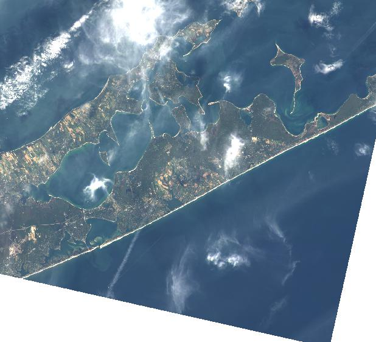
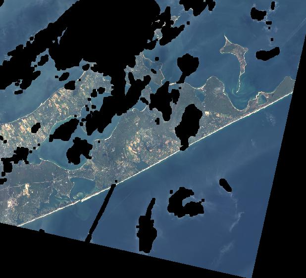

[](https://travis-ci.org/mapbox/rio-cloudmask)
[](https://coveralls.io/github/mapbox/rio-cloudmask?branch=master)

# rio-cloudmask

Rasterio plugin for identifying clouds in multi-spectral satellite imagery.

This project is based laregely on the research by Zhu and Woodcock

* (2012) [Object-based cloud and cloud shadow detection in Landsat imagery](https://www.researchgate.net/publication/256850150_Object-based_cloud_and_cloud_shadow_detection_in_Landsat_imagery)
* (2015) [Improvement and expansion of the Fmask algorithm: Cloud, cloud shadow, and snow detection for Landsats 4-7, 8, and Sentinel 2 images](https://www.researchgate.net/publication/270596187_Improvement_and_expansion_of_the_Fmask_algorithm_Cloud_cloud_shadow_and_snow_detection_for_Landsats_4-7_8_and_Sentinel_2_images)

as well as the subsequent [fmask](https://github.com/prs021/fmask) and [cfmask](https://github.com/USGS-EROS/espa-cloud-masking/tree/master/cfmask) software implementations.

Why build our own? The `CFmask` software produces excellent results but is designed to be part of a larger USGS processing framework, thus bringing with it some implementation overhead and assumptions that prevent easy integration with other systems. In short, we need a `pip install`able, numpy-based tool that works with GDAL raster formats and integrates well with Rasterio data processing pipelines.

## Example

Given this input data from Landsat 8 (`LC80130312015295LGN00`)



Assuming we've already derived Top of Atmosphere (TOA) reflectance and brightness temperatures using [rio-toa](https://github.com/mapbox/rio-toa), we can use those to create a uint8 mask suitable for use as an alpha band in an RGBA image:

```
rio cloudmask LC8*_B[2-7]_toa.tif LC8*_B9_toa.tif LC8*_B10_toa.tif -o test.tif
```




## Status

The first iteration of the cloudmask algorithm implements the *potential* cloud layer

Still to do...

* cloud shadow and snow detection (section 3.1 in Zhu, Woodcock 2012 with subsequent changes from 2015 paper) for Landsat 8.

* Landsat 4-7 (TM/ETM+) sensors lack the **cirrus** band which is a critical component to high-quality cloud masks. However, the algorithm could be adjusted in the future by optionally ommiting the cirrus tests.

* Sentinel 2 does not include a **thermal** band which is heavily used by this implementation. In the future, we may adjust the algorithm (per Zhu, Woodcock 2015, section 2.2.2) to account for this and allow for use with Sentinel 2 data.

* The **object-based** cloud and show matching may be implemented at a later time if needed. (per Zhu, Woodcock 2012, section 3.2)


## See also

Another Python implementation: [Python Fmask](http://pythonfmask.org/en/latest/)
